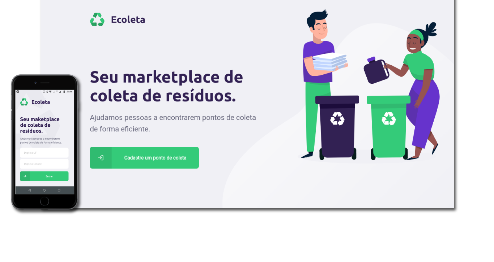

<h1 align="center">
  
</h1>

<h4 align="center"> 
	🚧 Ecoleta concluído 🚧
</h4>

<br/>

<p align="center">
 <a href="#sobre-o-projeto">Sobre o projeto</a> • 
 <a href="#funcionalidades">Funcionalidades</a> • 
 <a href="#layout">Layout</a> • 
 <a href="#como-executar-o-projeto">Como executar o projeto</a> • 
 <a href="#tecnologias">Tecnologias</a> • 
 <a href="#contribuidores">Contribuidores</a> • 
 <a href="#autor">Autor</a> • 
<a href="#licenc-a">Licença</a> • 
</p>
<br/>

## Sobre o projeto

<p align="left">Ecoleta é um sistema que ajuda a encontrar empresas ou outras pessoas que fazem o descarte adequado de resíduos orgânicos e não orgânicos.

Projeto desenvolvido durante a semana Next Level Week - NLW oferecida pela  [Rocketseat](https://blog.rocketseat.com.br). O NLW é uma experiência online com muito conteúdo prático, desafios e hacks onde o conteúdo fica disponível durante uma semana.
</p>

<br/>

##  Funcionalidades
- [x] Empresas ou entidades podem se cadastrar na plataforma web enviando:
  - [x] uma imagem do ponto de coleta
  - [x] nome da entidade, email e whatsapp
  - [x] e o endereço para que ele possa aparecer no mapa
  - [x] além de selecionar um ou mais ítens de coleta: 
    - lâmpadas
    - pilhas e baterias
    - papéis e papelão
    - resíduos eletrônicos
    - resíduos orgânicos
    - óleo de cozinha

- [x] Os usuários têm acesso ao aplicativo móvel, onde podem:
  - [x] navegar pelo mapa para ver as instituições cadastradas
  - [x] entrar em contato com a entidade através do E-mail ou do WhatsApp
---

## Layout

Web: 
<h1 align="center">
  
</h1>


Mobile: 
<p align="center"> 
  
  
</p>

</h1>


---
## Como executar o projeto
Este projeto é divido em três partes:
1. Backend (pasta backend) 
2. Frontend (pasta web)
3. Mobile (pasta mobile)

Tanto o Frontend quanto o Mobile precisam que o Backend esteja sendo executado para funcionar.

### Pré-requisitos

Antes de começar, você vai precisar ter instalado em sua máquina as seguintes ferramentas:
[Git](https://git-scm.com) é um editor para trabalhar com o código como [VSCode](https://code.visualstudio.com/)

#### 🎲Clonando o projeto

```bash

# Clone este repositório
$ git clone git@github.com:andersonzeroone/Ecoleta-NLW.git

# Acesse a pasta do projeto no terminal/cmd
$ cd Ecoleta-NLW

```
#### 🎲 Rodando o server (servidor)

```bash

# Acesse a pasta do projeto no terminal/cmd
$ cd server

# Instale as dependências
$ npm install ou yarn install

# Execute a aplicação
$ npm start ou  yarn start 

# O servidor iniciará na porta:3333 - acesse http://localhost:3333 

```
<!-- <p align="center">
  <a href="https://github.com/tgmarinho/README-ecoleta/blob/master/Insomnia_API_Ecoletajson.json" target="_blank"></a>
</p> -->

#### 🧭 Rodando a aplicação web (Frontend)

```bash

# Vá para a pasta da aplicação Front End
$ cd web

# Instale as dependências
$ npm install ou yarn install

# Execute a aplicação em modo de desenvolvimento
$ npm start ou  yarn start 

# A aplicação será aberta na porta:3000 - acesse http://localhost:3000

```

#### 🧭 Rodando a aplicação mobile

```bash

# Vá para a pasta da aplicação Front End
$ cd Mobile

# Instale as dependências
$ npm install ou yarn install

# Execute a aplicação em modo de desenvolvimento
$ expo start

# A aplicação será aberta na porta:3000 - acesse http://localhost:3000

acesse localhost:19002, leia o QR Code no seu celular e utilize o aplicativo Expo para rodar a versão mobile no seu smartphone. Ou com algum emulador Android/iOS para rodar no seu computador.

```
##  Tecnologias

As seguintes ferramentas foram usadas na construção do projeto:

#### **Website**  ([React](https://reactjs.org/)  +  [TypeScript](https://www.typescriptlang.org/))

-   **[React Router Dom](https://github.com/ReactTraining/react-router/tree/master/packages/react-router-dom)**
-   **[React Icons](https://react-icons.github.io/react-icons/)**
-   **[Axios](https://github.com/axios/axios)**
-   **[Leaflet](https://react-leaflet.js.org/en/)**
-   **[React Leaflet](https://react-leaflet.js.org/)**
-   **[React Dropzone](https://github.com/react-dropzone/react-dropzone)**

> Veja o arquivo  [package.json](https://github.com/andersonzeroone/Ecoleta-NLW/blob/master/web/package.json)

#### **Server**  ([NodeJS](https://nodejs.org/en/)  +  [TypeScript](https://www.typescriptlang.org/))

-   **[Express](https://expressjs.com/)**
-   **[CORS](https://expressjs.com/en/resources/middleware/cors.html)**
-   **[KnexJS](http://knexjs.org/)**
-   **[SQLite](https://github.com/mapbox/node-sqlite3)**
-   **[ts-node](https://github.com/TypeStrong/ts-node)**
-   **[dotENV](https://github.com/motdotla/dotenv)**
-   **[Multer](https://github.com/expressjs/multer)**
-   **[Celebrate](https://github.com/arb/celebrate)**
-   **[Joi](https://github.com/hapijs/joi)**

> Veja o arquivo  [package.json](https://github.com/andersonzeroone/Ecoleta-NLW/blob/master/server/package.json)

#### **Mobile**  ([React Native](http://www.reactnative.com/)  +  [TypeScript](https://www.typescriptlang.org/))

-   **[Expo](https://expo.io/)**
-   **[Expo Google Fonts](https://github.com/expo/google-fonts)**
-   **[React Navigation](https://reactnavigation.org/)**
-   **[React Native Maps](https://github.com/react-native-community/react-native-maps)**
-   **[Expo Constants](https://docs.expo.io/versions/latest/sdk/constants/)**
-   **[React Native SVG](https://github.com/react-native-community/react-native-svg)**
-   **[Axios](https://github.com/axios/axios)**
-   **[Expo Location](https://docs.expo.io/versions/latest/sdk/location/)**
-   **[Expo Mail Composer](https://docs.expo.io/versions/latest/sdk/mail-composer/)**

> Veja o arquivo  [package.json](https://github.com/andersonzeroone/Ecoleta-NLW/blob/master/Mobile/package.json)

**Utilitários**

-   Protótipo:  **[Figma](https://www.figma.com/)**  
-   API:  **[IBGE API](https://servicodados.ibge.gov.br/api/docs/localidades?versao=1)**  →  **[API de UFs](https://servicodados.ibge.gov.br/api/docs/localidades?versao=1#api-UFs-estadosGet)**,  **[API de Municípios](https://servicodados.ibge.gov.br/api/docs/localidades?versao=1#api-Municipios-estadosUFMunicipiosGet)**
-   Maps:  **[Leaflet](https://react-leaflet.js.org/en/)**
-   Editor:  **[Visual Studio Code](https://code.visualstudio.com/)**  → Extensions:  **[SQLite](https://marketplace.visualstudio.com/items?itemName=alexcvzz.vscode-sqlite)**
-   Markdown:  **[StackEdit](https://stackedit.io/)**,  **[Markdown Emoji](https://gist.github.com/rxaviers/7360908)**
-   Commit Conventional:  **[Commitlint](https://github.com/conventional-changelog/commitlint)**
-   Teste de API:  **[Insomnia](https://insomnia.rest/)**
-   Ícones:  **[Feather Icons](https://feathericons.com/)**,  **[Font Awesome](https://fontawesome.com/)**
-   Fontes:  **[Ubuntu](https://fonts.google.com/specimen/Ubuntu)**,  **[Roboto](https://fonts.google.com/specimen/Roboto)**

## Contribuidores

💜 Um super thanks 👏 para essa galera que fez esse produto sair do campo da ideia e entrar nas lojas de aplicativos :)

## Como contribuir para o projeto

1. Faça um **fork** do projeto.
2. Crie uma nova branch com as suas alterações: `git checkout -b my-feature`
3. Salve as alterações e crie uma mensagem de commit contando o que você fez: `git commit -m "feature: My new feature"`
4. Envie as suas alterações: `git push origin my-feature`
> Caso tenha alguma dúvida confira este [guia de como contribuir no GitHub](./CONTRIBUTING.md)

---

##  Autor
</br>

<a href="https://github.com/andersonzeroone">
 
 <br />
 <br />
 <sub><b>Anderson Pablo</b></sub></a> <a href="https://www.linkedin.com/in/anderson-pablo-js/" title="andersonPablo">🚀</a>
 <br />


 [](https://www.linkedin.com/in/anderson-pablo-js/) 
[](mailto:anderson.pablo02@gmail.com)

---

## Licença

Este projeto está sob a licença [MIT](./LICENSE).

Feito com ❤️ por Anderson Pablo 👋🏽 [Entre em contato!](https://www.linkedin.com/in/anderson-pablo-js/)

---

<!-- ##  Versões do README

[Português 🇧🇷](./README.md)  |  [Inglês sem emojis 🇺🇸](./README-en.md) | [Portugues sem logo  🇧🇷](./README-sem-logo.md)  -->