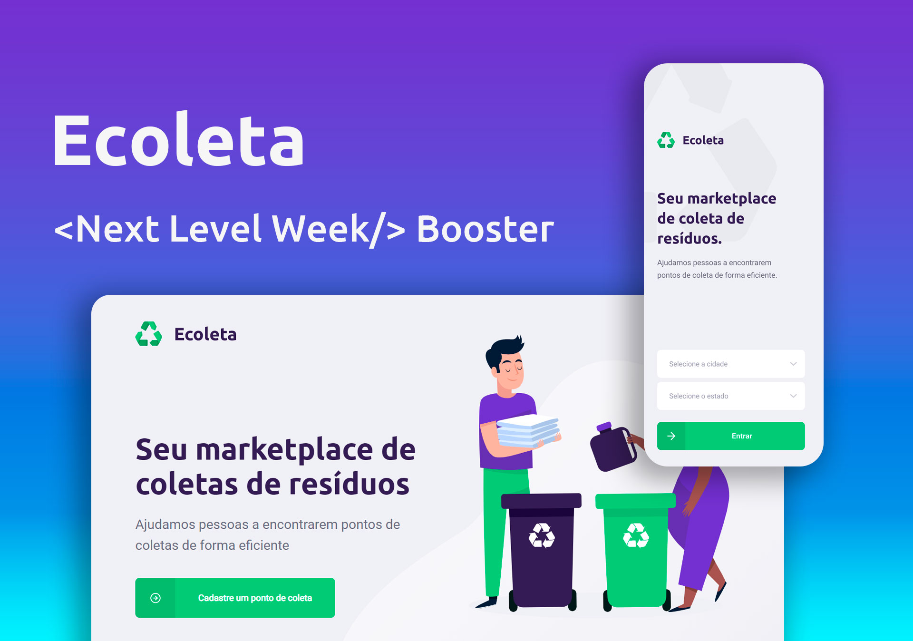

## Ecoleta



### Sobre o Projeto

O Ecoleta foi um projeto desenvolvido durante a Next Level WeeK pela Rocketseat.
O NLW(Next Level WeeK) tem como objetivo demotrar na prática as princinpais ferramentas utlizadas atualmente no mercado de trabalho. A NLW foi divida em dois grupos, Booster e Starter. A booster é direcionada para quem já tem algum contato com a programção e o starter para quem esta començando.

### Tecnologias:

  #### Back-end:

       * cors;
       * express;
       * knex;
       * sqlite3.

   #### Web:

       * axios;
       * leaflet;
       * react1;
       * react-dom;
       * react-icons;
       * react-leaflet;
       * react-router-dom;
       * react-scripts  ;     
       * typescript.

   #### Mobile:

        * axios; 
        * constants;
        * expo; 
        * expo-font;
        * react; 
        * react-dom; 
        * react-native;
        * react-native-gesture-handler;
        * react-native-maps;
        * react-native-reanimated;
        * react-native-safe-area-context;
        * react-native-screens;
        * react-native-svg;
        * react-native-web.

### Como rodar o projeto  

È preciso instar o nodeJs(v13) ou o yarn para poder instalar os pacotes necessarios e rodar o projeto.

*Existi algumas incopatibilidae com o nodeJs em versões posteriores a v13.

#### Clonar o repositório

```css
# Clonar o repositório:
git clone git@github.com:andersonzeroone/Ecoleta-com-React-JS-e-React-native.git
```

#### Siga os passos

##### Servidor
```css
# Abrir a pasta do server
 npm i 

# Em seguida inici o servidor 
 npm run dev
```

##### Projeto web
```css
# Abrir a pasta web
 npm i 

# Em seguida inici o servidor 
 npm start
```

##### Projeto Mobile
```css
# Abrir a pasta mobile
 npm i 

# Em seguida inici o servidor 
 npm start
```